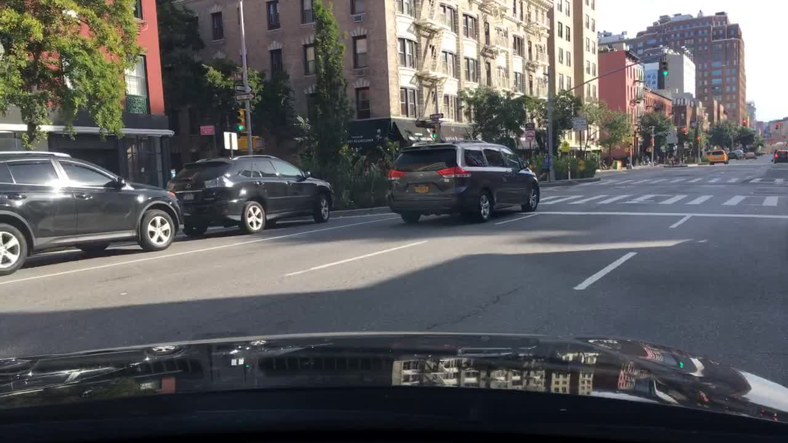
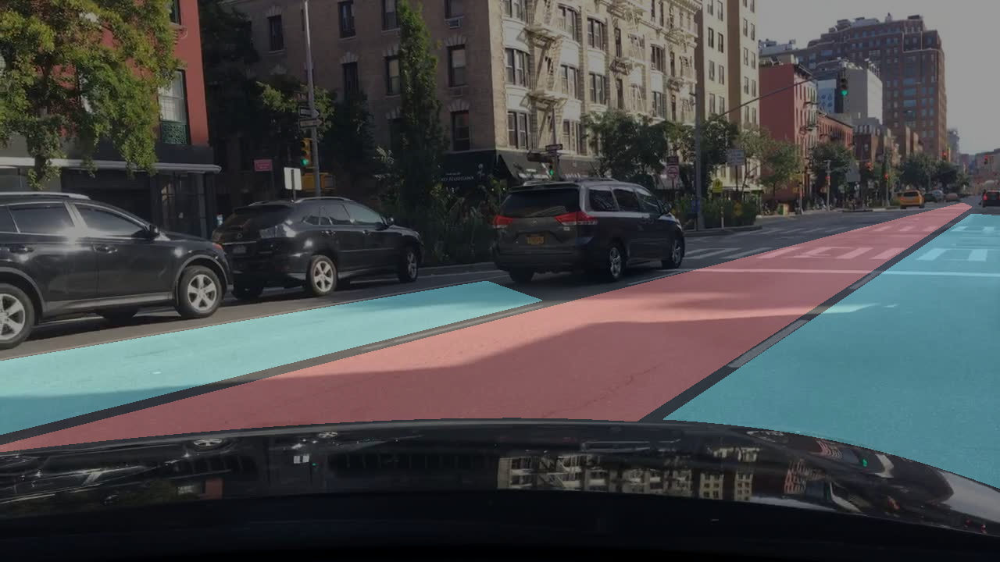
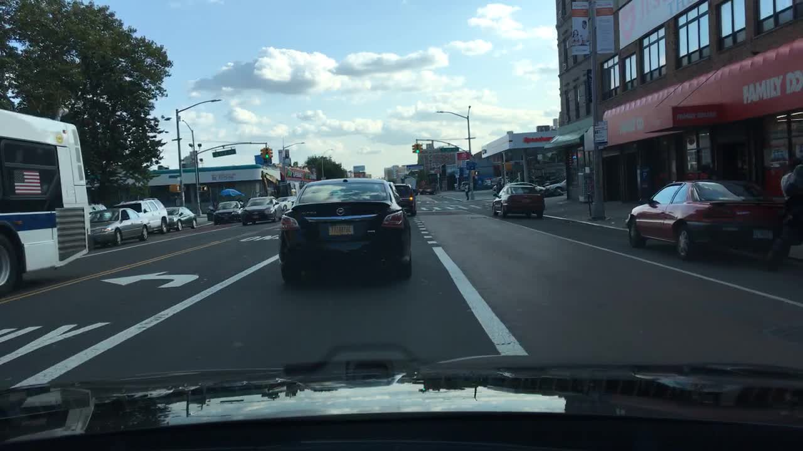
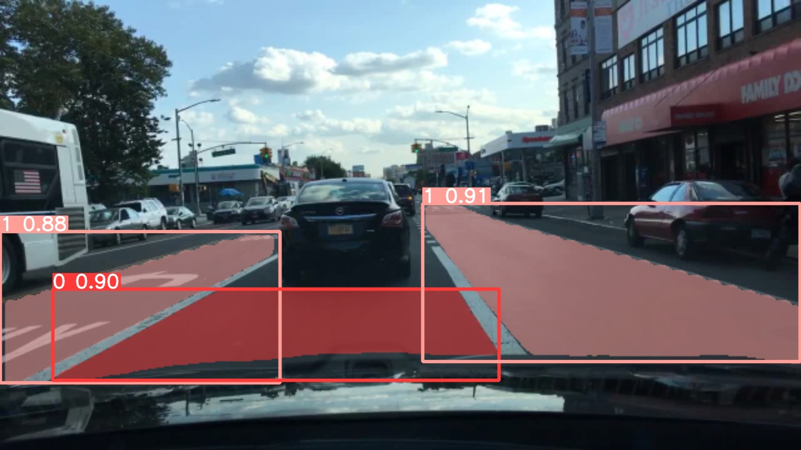

# ADAS project

This projects consists of two or three different flask servers, each of which will be containerized and pushed to AWS Fargate

## flask app 1
This app takes a url of an image on s3 and returns a url of the annotated image

- Original Image

- Annotated Image

## flask app 2
This app takes a url of an image on s3 and returns a url to the segmented image using YOLO v2

## flask app 3
This app takes a url of an image on s3 and returns a url to the segmented image using YOLO v8

- Original Image

- Segmented Image

